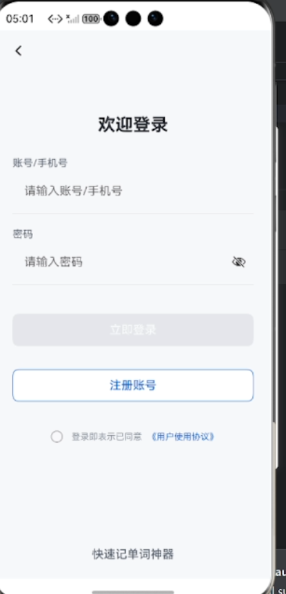
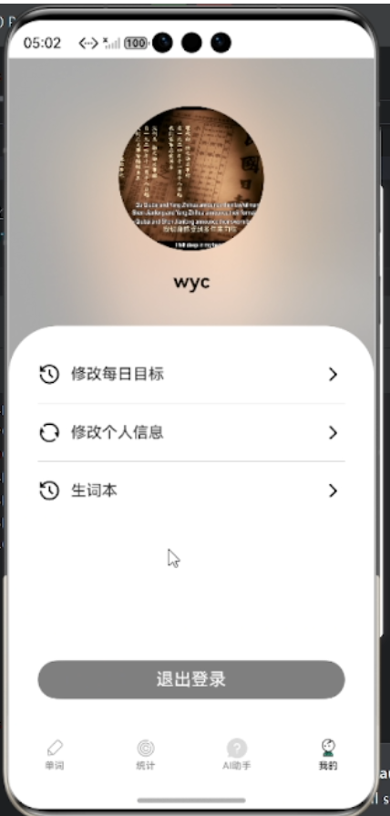
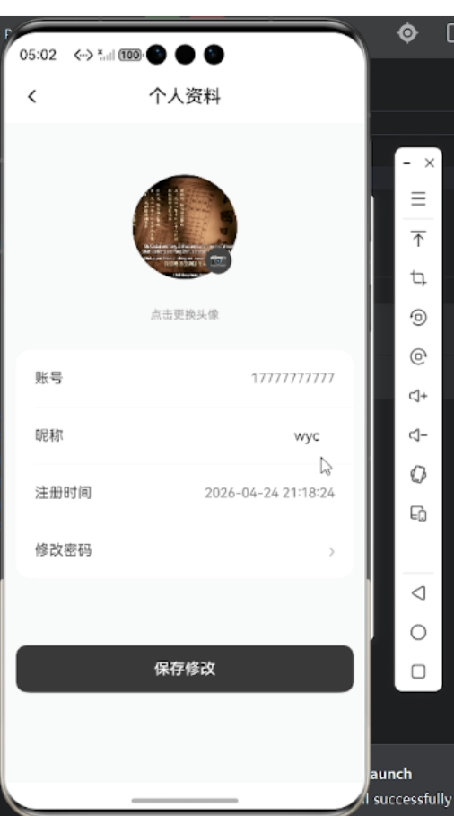
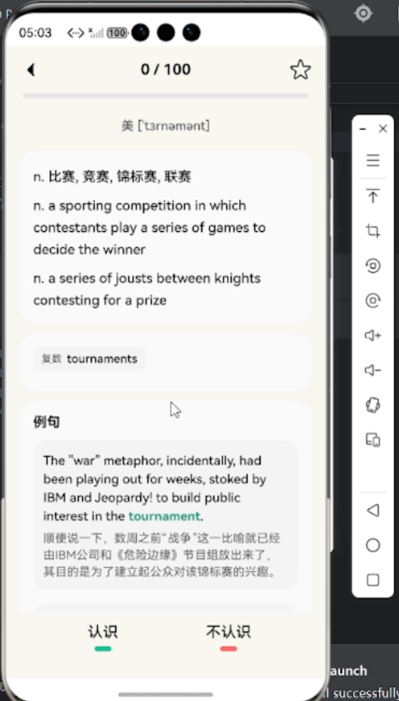
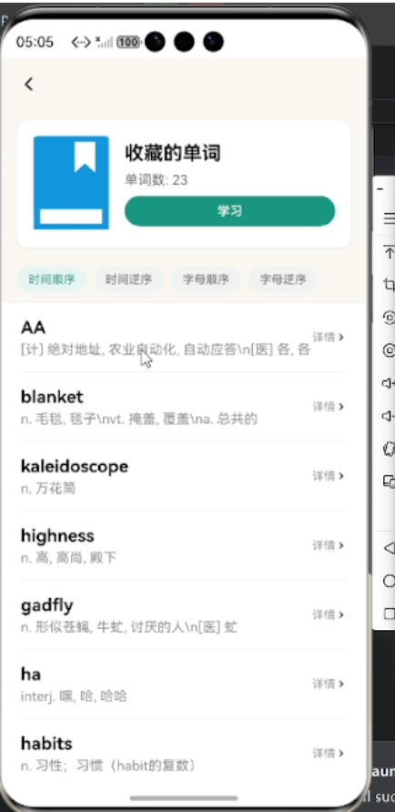
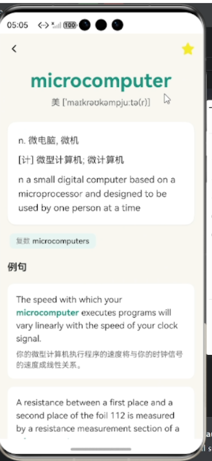
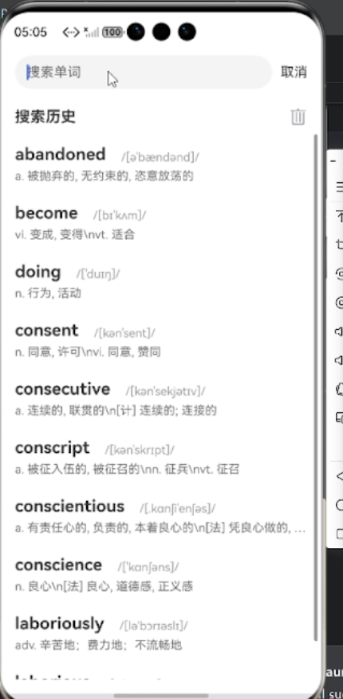

# MemoWord

鸿蒙平台的背单词APP

## ✨ 主要功能

- **功能1:** 根据用户每日背单词数提供每日背诵单词。
- **功能2:** 提供单词本，可以复习见过的单词。
- **功能3:** AI辅助学习。

## 🛠️ 使用技术

本项目使用了一下的技术和工具：

- HarmonyOS ArkTS
- Java
- C#、YARP、ASP .NET Core
- ElasticSearch
- docker
